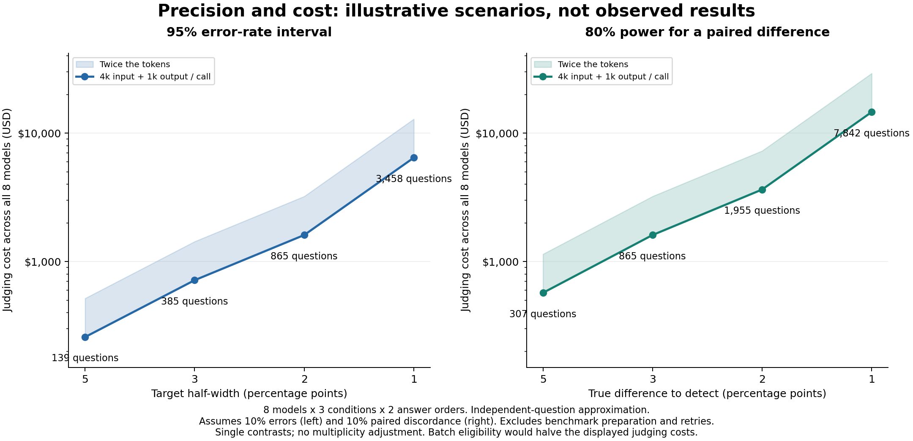

# Partner feedback: hierarchy, spending, precision and explanations

Prepared 2026-09-13. This is a planning and accounting review. No paid model calls were made, and no new experiment was launched.

The useful next question is whether verification becomes more reliable as capability increases within a model family. Our existing results establish model-dependent behavior on the old benchmark, but do not identify a capability threshold or a parameter-scaling law. The question audit also makes a clean, held-out benchmark a prerequisite for stronger claims.

## 1. Test a hierarchy without conflating capability and protocol response

Measure two outcomes separately: full-source answer accuracy, and the paired change in error when verification is added to the same debate. Better baseline accuracy does not guarantee better use of verification. Plot both against the preselected tiers, allowing ties and reversals rather than imposing a ranking.

Use at least three tiers within each of two families. There are two different studies we could conduct:

| Question | Suitable comparison | Limitation |
|---|---|---|
| Does more parameter capacity help within a generation? | Llama 3.1 8B/70B/405B, or Qwen3 dense 8B/14B/32B | Complete current hosting and pricing are not yet established. |
| Does a higher marketed capability tier help? | OpenAI Luna/Terra/Sol and Claude Haiku/Sonnet/Opus, with Astra and Fable as frontier anchors | Product tiers are not parameter counts; Claude tiers also span generations. |

Keep generation, architecture class, quantization, provider, prompt and inference configuration as comparable as the research question permits. Total MoE parameters and dense parameters are not one common size axis. A 70B model from a newer generation beating a 405B model is not, by itself, evidence that scaling hurts. Together retired its Llama 3.1 serverless ladder; substituting Llama 3.3 70B would change the experiment. [Model options and current primary sources](model-options.md).

Proposed core design: full-source capability anchor, debate without verification, and the same debate with verification, each in both answer orders. Use the same questions and fixed evidence packets across models. Generate debate material independently of the recipient model, balancing any donor source. This isolates recipient behavior; an adaptive end-to-end debate system would require a later test.

Predeclare the four adjacent-tier contrasts across the two three-tier families. Treat the frontier anchors and cross-family comparisons as secondary unless separately powered. If the tier ordering is learned from a capability pilot, validate it on held-out data rather than selecting and testing the ordering on the same outcomes. The effect of tier on verification benefit is an interaction and needs its own variance estimate.

The cleaner benchmark is not ready. Only 5/82 existing questions were classified as source-determined by both audit reviewers; 25 required extra inference, 39 were underdetermined, and 13 had reviewer disagreement. This is not an estimate that the remaining answer keys are wrong. The five questions have already been used and cannot serve as a fresh confirmatory benchmark. Build new source-complete worlds and questions, validate the full candidate answers, balance answer length and position, and include questions whose correct response is insufficient evidence when appropriate. Use a declared sampling frame spanning more worlds and domains; adding near-duplicate questions within the same three worlds does not buy broad generalization. [Question audit](../question-evidence-audit-2026-09-12/audit.md).

## 2. What we have spent and what remains

| Accounting measure | USD |
|---|---:|
| Historical provider baseline plus later recorded Together usage | $1,322.02 |
| Retained unknown charges and unresolved reservation bounds | $148.17 |
| Conservative Together accounted subtotal | **$1,470.19** |
| Conditional remainder from the documented $8,000 spendable budget | **$6,529.81** |

These are not an all-in project financial statement. Historical Anthropic reviewer charges, subscription fees or overages, and other project expenses remain unreconciled. The $10,000 headline grant is distinct from the $8,000 documented spendable budget. Against the full $10,000, the corresponding conditional remainder would be $8,529.81, but the extra $2,000 is not assumed available.

The $1,800 in Together top-ups was prepaid funding, not additional usage. Current provider credit is unknown. A historical provider settlement lowers the billing-adjusted usage estimate to $1,315.17, but later periods lack a current provider reconciliation. Retaining uncertain exposure gives the more cautious planning subtotal above; uncertainty is not proof of a charge. Completing the all-in total requires the current Together statement and project-attributable Anthropic/subscription charges.

The reconstruction includes earlier preflights, canaries, retired Phase 2 ledgers, both voided Phase 3 main attempts, retries and Phases 4-5. Copied archives, carry-forward entries, caps and forecasts were not added as new spending. [Reconciliation and sources](spend-audit.md).

## 3. Frontier access and subscription billing

Current official documentation supports native scriptable Codex and Claude Code workflows using subscriptions within plan limits. That can make a small native-CLI pilot inexpensive in incremental cash. It consumes shared subscription allowance and does not establish unlimited capacity. Raw API calls are separately billed. A CLI benchmark also measures its agent wrapper, system instructions, context and tools, which complicates comparison with direct API judges. [Codex plan documentation](https://learn.chatgpt.com/docs/pricing), [Claude subscription authentication](https://code.claude.com/docs/en/authentication).

For a formal model comparison, prefer directly controlled API endpoints unless product/agent behavior is itself the target. The eight-model product-tier roster is currently priceable from official documentation, though account access has not been verified. At an illustrative 4,000 uncached input plus 1,000 billed output tokens per call, 1,000 calls for each of the eight models totals $310. Listed Batch rates halve that to $155 when eligible. Reasoning tokens count toward billed output. [OpenAI pricing](https://developers.openai.com/api/docs/pricing), [Claude pricing](https://platform.claude.com/docs/en/about-claude/pricing).

## 4. What narrower error bars cost

The table is a transparent scenario, not a quote for the finished experiment. It prices all eight product-tier models, three conditions and two answer orders, or 48 judge calls per question. The baseline is $1.86 per question across all models at 4k input/1k output tokens per call; the second cost doubles both token counts. Neither is an upper bound. Benchmark authoring, source validation, debate/evidence preparation, reviewer charges, retries, subscriptions and taxes are excluded.

For a single error rate near 10%, the approximate effective independent question count for a 95% interval of half-width h is `N = ceil(1.96^2 * 0.1 * 0.9 / h^2)`. These are marginal intervals per rate, not simultaneous confidence bands across all models and conditions.

| Target 95% half-width | Effective independent questions | Baseline judging cost | Twice the tokens |
|---|---:|---:|---:|
| +/-5 percentage points | 139 | $259 | $517 |
| +/-3 percentage points | 385 | $716 | $1,432 |
| +/-2 percentage points | 865 | $1,609 | $3,218 |
| +/-1 percentage point | 3,458 | $6,432 | $12,864 |

This illustrates why halving error-bar width costs roughly four times as much. If errors are near 50%, the corresponding counts are 385, 1,068, 2,401 and 9,604, about 2.8 times larger. The two answer orders are repeated measures, not two independent questions. Shared worlds can further reduce effective sample size. For illustration, clusters of ten questions with within-world correlation 0.1 give a design effect of `1 + (10 - 1) * 0.1 = 1.9`; this is a sensitivity example, not an estimate from our data. Confirmatory planning needs pilot variance and world-level replication.

Nonoverlap between separate model intervals is not the right purchasing target. Use an interval for the paired difference, together with a predeclared practically important difference. Separate 95% intervals can overlap even when their paired difference excludes zero. If models are tied, more money will not produce a legitimate guaranteed separation.

For illustration, if two binary outcomes disagree on 10% of questions, a two-sided paired comparison with 80% power to detect a true 3-point difference needs about 865 effective independent questions. At the same eight-model design price, that is $1,609 baseline or $3,218 with doubled tokens. Conservative correction for four planned comparisons raises the count to 1,228 and the baseline judging cost to $2,284. Power here is per contrast, not the probability that all four contrasts succeed. Detecting a 1-point difference is much more expensive: about 7,842 questions and $14,586 before multiplicity or preparation.

These paired calculations use the normal planning approximation `N = ceil((z_alpha + z_power)^2 * (discordance - difference^2) / difference^2)`. They model one binary score per effective question while pricing both answer orders, without claiming additional independent samples from the second order. They are not exact power guarantees. Averaged mirror outcomes, tier-by-protocol interactions, near-zero errors and clustering require pilot-based simulation or a suitable paired/hierarchical analysis. The same 865 count appearing in the precision and power examples is coincidental. None of these intervals corrects benchmark bias.

Historical token usage supports measuring a pilot before fixing a cap: Phase 5 averaged 5,273 input/1,890 billed output tokens per Qwen verdict, versus 5,134/136 for Llama. New models and a cleaner task can differ again. The apparent narrow Phase 5 interaction interval on 82 reused questions is not the price of a 1-point general-capability interval.

Exact scenario data: [precision-cost.json](precision-cost.json). Reproduce with `C:\Python314\python.exe scripts/partner_precision_cost.py --out reports/partner-feedback-2026-09-13 --plot` from the repository root.

## 5. Judge explanations are already available

All **26,892 completed main judge verdicts** across Phase 3, 4A, 4B recipients and Phase 5 include a visible rationale and confidence from 1 to 5. We can begin with saved outputs and no new judge calls. The inventory is complete; a comprehensive coded mechanism audit is not. There is no standardized evidence-ID or citation field, and confidence is an ordinal self-report rather than a calibrated probability. [Inventory and example audit](explanations-audit.md).

Existing examples suggest testable patterns: rejecting a narrow claim can lead a judge to reject a broader premise, or verifying an incidental fact can lead it to make an unsupported decision-relevant inference. Those are candidate mechanisms, not established frequencies or proof of the internal reason for an answer.

Next, code a seeded sample of matched rationales covering both models, worlds, conditions, improvements, regressions and stable outcomes. Join the question-ambiguity labels and use two partially blinded reviewers. Report scope errors, relevance, unsupported extensions, missing-evidence handling and reviewer disagreement. Sampling weights are needed before using an outcome-balanced sample to estimate population frequencies.

For a future explanation format, request a short decision summary, evidence IDs and short exact citations. Validate the cited text and keep explanation-format changes as a separate intervention. Stronger causal evidence comes from changing the inputs: remove cited versus uncited facts, consistently reverse decisive facts in controlled worlds, and perturb irrelevant facts. A rationale predicts what should matter; those interventions test the prediction.

## Recommended order

First audit the saved explanations and finish a small clean benchmark pilot across new worlds. Then measure real token usage, error rates, paired disagreement and world dependence with three tiers from each of two families plus frontier anchors. Use those measurements to select and freeze a confirmatory sample size and cash cap. Prioritize resolving a practically meaningful 3-5 point difference before funding 1-point precision. The current evidence does not justify buying a much larger run on the old question bank or claiming that all reasonable explanations have been exhausted.
