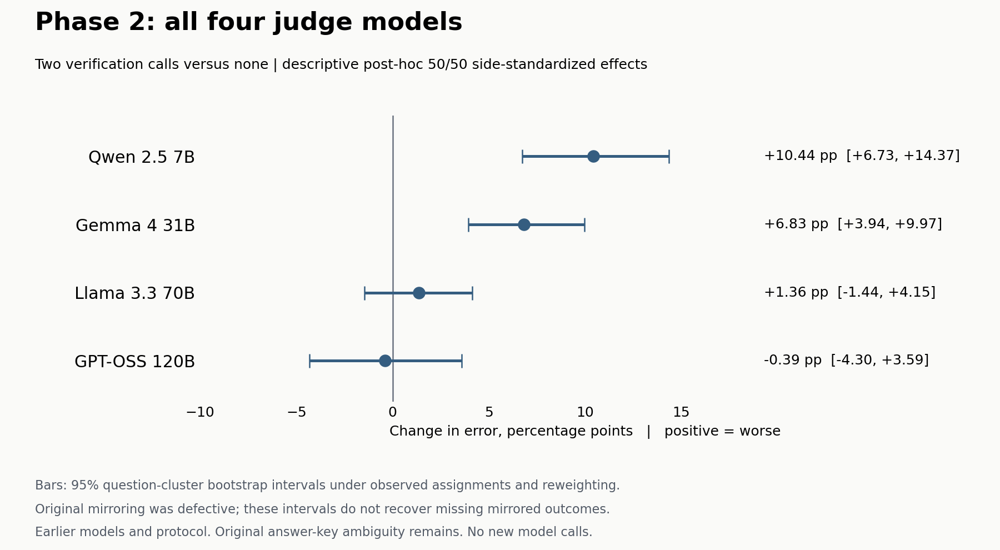

# Phase 2 model charts

These are the four judge models in the earlier Phase 2 experiment. Phases 3-5 evaluated Qwen 3.8 and Llama 3.3 as recipient judges. GPT-OSS also served as an oracle-label adjudicator in Phase 4B, a different role.

Effect = error with two sequential verification calls minus error with no verification. Positive values mean worse performance against the original answer key.

| Judge | Effect (pp) | Descriptive 95% interval (pp) |
|---|---:|---:|
| Qwen 2.5 7B | +10.44 | [+6.73, +14.37] |
| Gemma 4 31B | +6.83 | [+3.94, +9.97] |
| Llama 3.3 70B | +1.36 | [-1.44, +4.15] |
| GPT-OSS 120B | -0.39 | [-4.30, +3.59] |

The points use the saved post-hoc 50/50 side-standardization method. Per-judge intervals were computed using the same 10,000 world-stratified question-bootstrap draws and frozen engine. Every point is independently checked against the saved pooled and leave-one-judge-out estimates. Original results and scoring are unchanged.

The original Phase 2 mirroring was defective. Reweighting does not recover the missing opposite-side outcomes or restore the withdrawn eligibility claims. These are descriptive intervals conditional on observed assignments and the reweighting assumption, not a new confirmatory comparison. The later answer-key audit also applies to this reused question set.

Sources: [Phase 2 results and erratum](../2026-08-11-phase2-main-results.md), [source audit](../question-evidence-audit-2026-09-12/audit.md), [chart data and provenance](effects.json).

Newer charts: [Phase 3](../phase3-results-2026-09-11/phase3-results.png), [Phase 4B](../phase4b-recipient-results-2026-09-12/recipient-effects.png), [Phase 5](../phase5-results-2026-09-12/phase5-effects.png).
