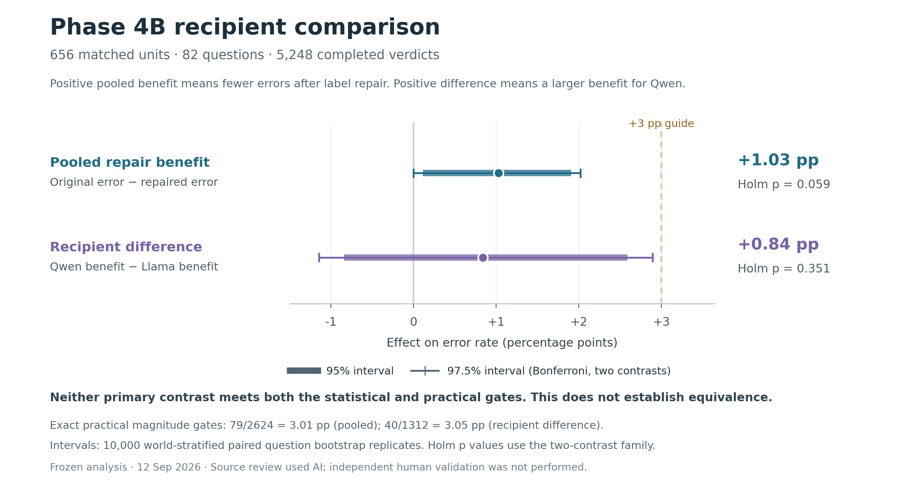

# Phase 4B recipient comparison result

**Decision: stop this branch before Phase 4C.** The estimated pooled error reduction was **1.029 percentage points**, but the result failed both the prespecified practical and adjusted statistical gates. This supports a possible small benefit from this correction set; it does not establish a large repair effect or explain the earlier Qwen/Llama difference.

All **5,248/5,248 verdicts completed and parsed validly**, with zero administrative missingness. Collection took **46.0 minutes**, ending at **1:56 PM Eastern on September 12, 2026**. Recorded usage was **$71.08261336**, including preflight, plus **$0.353332** retained uncertainty from one recovered HTTP 503. Total accounting exposure was **$71.43594536 of the approved $150 cap**. Both endpoints reached 16 workers; completed verdicts were never repeated.

**Prespecified primary tests.** Positive pooled benefit means fewer errors after repair. Recipient difference is Qwen's benefit minus Llama's, with both donor histories weighted equally. Intervals and effects below are in percentage points.

| Primary | Estimate | 95% interval | 97.5% interval | Holm p | Exact practical gate | Outcome |
|---|---:|---:|---:|---:|---|---|
| Pooled repair benefit | +1.029 | [+0.114, +1.905] | [0.000, +2.020] | 0.059194 | 27/2,624; absolute numerator must reach 79 | Does not pass |
| Qwen minus Llama benefit | +0.838 | [-0.838, +2.591] | [-1.143, +2.896] | 0.351365 | 11/1,312; absolute numerator must reach 40 | Does not pass |

The pooled unadjusted p-value is 0.029597, but the frozen two-primary Holm correction gives 0.059194. Its ordinary 95% interval excluding zero therefore does not satisfy the declared adjusted gate. The 97.5% marginal intervals provide the Bonferroni family coverage check. The practical thresholds were frozen before recipient outcomes; they are approximately 3 points, with exact integer thresholds shown above. Neither primary passes its statistical, practical, decision or semantic follow-up gate. Phase 4C additionally requires positive pooled benefit with matching statistical and semantic support. Its entry eligibility is **false**.

**Descriptive pattern.** Each original/repaired cell has 656 matched units. Counts are strict errors; lower is better.

| Recipient | Donor history | Original errors | Repaired errors | Error reduction |
|---|---|---:|---:|---:|
| Qwen | Qwen | 94 (14.33%) | 73 (11.13%) | +3.201 pp |
| Qwen | Llama | 51 (7.77%) | 53 (8.08%) | -0.305 pp |
| Llama | Qwen | 61 (9.30%) | 55 (8.38%) | +0.915 pp |
| Llama | Llama | 68 (10.37%) | 66 (10.06%) | +0.305 pp |

Averaged across donors, Qwen improves by 1.448 pp and Llama by 0.610 pp. The largest cell improvement is Qwen reading Qwen histories, but that cell is descriptive and cannot replace the failed primary gate. Across all matched pairs, 66 change from error to correct and 39 from correct to error, for 27 net fewer errors. Both versions were generated fresh, including identical-message histories, so individual flips cannot all be attributed to label edits.

**Validity and scope.** All 656 units remain in the common-valid analysis, which reproduces the primary results. With no invalid or missing verdicts, the invalid/missing-outcome bounds collapse to the observed estimates; they are not confidence intervals. Completion hashes, database counts, zero in-flight requests, source/authorization identity, clean process exit and absence of repeated completed cells were verified. Before launch, 74 focused tests and a full mocked interruption/recovery rehearsal passed. An independent Codex pass reparsed every raw verdict and exactly reproduced all arm counts, integer contrasts, 10,000 bootstrap draws, intervals, Holm corrections and gates.

The intervention changes 549 reviewed claims in 588 of 1,312 histories, preserving all other history text and all 1,704 blocked exchanges. The fixed 20-claim source check used **amended Codex AI review, not independent human validation**; five ambiguous corrections were excluded. This study concerns final readout of captured histories for two fixed endpoints, 82 selected questions and three fictional worlds. It does not estimate the effects of a corrected live adaptive-querying policy, prove no oracle-error contribution, establish model equivalence, or generalize to models as a population. No fresh empty arm was run here, so the Phase 4A recipient contrast cannot be causally decomposed using these numbers.

**Next action.** Close the planned label-repair branch and retain the conditional model-dependent result from Phase 4A alongside this smaller repair estimate. No Phase 4C calls were made or authorized by this result. A future extension would require a distinct scientific question and separate approval.

[Machine-readable summary](summary.json) contains aggregate counts, gates, accounting and hashes. [Design](../../docs/phase4b-recipient-comparison.md) and [review amendment](../../rejudge/phase4b_ai_review_amendment_2026-09-12.json) define the scope. The frozen full analysis is at `E:\selvarath-archive\phase4b-label-repair-recipients-2026-09-12\analysis\phase4b_recipient_analysis.json`; raw prompts, gold answers and responses remain in the private archive.
