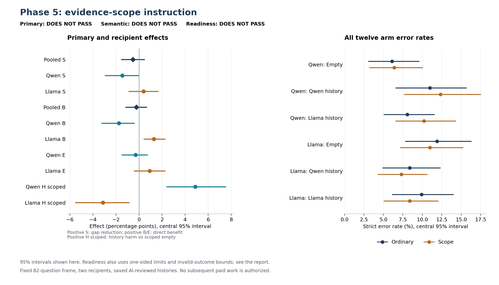

# Phase 5 evidence-scope result

**The fixed scope instruction did not demonstrate the planned history-specific improvement.** This does not establish a protocol that works across models.

With the two reviewed history sources weighted equally, the observed error rates were:

| Recipient | Ordinary instruction | Scope instruction | Change in error |
|---|---:|---:|---:|
| Qwen | 9.53% | 11.28% | +1.753 pp |
| Llama | 9.15% | 7.85% | -1.296 pp |

Positive change means more errors. These recipient comparisons are descriptive. The B intervals below use the opposite sign: positive B means fewer errors.

The observed changes go in opposite directions: the appendix worsened Qwen's history judgments while improving Llama's. Llama also improved without history, leaving a smaller history-specific estimate. This candidate therefore does not provide a shared repair. It weakens this specific instruction-based remedy; it does not rule out every evidence-interpretation mechanism or other protocol design.

Pooled S is **-0.534 percentage points**, with 95% interval **[-1.562, +0.495]**. Primary support: **DOES NOT PASS**. Semantic support: **DOES NOT PASS**. Candidate readiness: **DOES NOT PASS**. No subsequent paid work is authorized.

All **7,872/7,872** verdicts completed: **0 invalid**, zero administratively missing. Ledger usage is **$107.71741704**, retained uncertainty **$0.15679872**, and total exposure **$107.87421576** against a cap of **$200.00000000**. Completed-response cost alone is $107.71090864; it excludes other ledger entries.

Positive **S = B - E** means the instruction reduces the history-minus-empty error gap. Positive **B** means direct benefit on histories; positive **E** means benefit on empty context. Positive **H_scope** means histories are worse than **scoped empty**. S can improve when scoped empty worsens, so S alone does not establish direct benefit or readiness.

| Effect | Estimate (pp) | Central 95% interval (pp) | One-sided 95% lower | One-sided 95% upper |
|---|---:|---:|---:|---:|
| Pooled S | -0.534 | [-1.562, +0.495] | -1.372 | +0.343 |
| Qwen S | -1.448 | [-2.973, +0.000] | -2.668 | -0.229 |
| Llama S | +0.381 | [-0.915, +1.677] | -0.686 | +1.448 |
| Pooled B | -0.229 | [-1.181, +0.686] | -1.029 | +0.534 |
| Qwen B | -1.753 | [-3.277, -0.381] | -3.049 | -0.610 |
| Llama B | +1.296 | [+0.381, +2.287] | +0.534 | +2.134 |
| Qwen E | -0.305 | [-1.524, +0.762] | -1.372 | +0.610 |
| Llama E | +0.915 | [-0.457, +2.287] | -0.305 | +2.134 |
| Qwen H_scope | +4.878 | [+2.363, +7.548] | +2.744 | +7.165 |
| Llama H_scope | -3.125 | [-5.564, -0.838] | -5.107 | -1.220 |

The sole confirmatory test has two-sided p = **0.321968**; no Holm correction applies. The exact pooled contrast is **-14/2,624**, requiring numerator **at least 79**. Statistical screen: DOES NOT PASS; positive practical screen: DOES NOT PASS. The supplemental 97.5% interval is [-1.677, +0.648] pp. Intervals use 10,000 paired question-cluster bootstrap draws, stratified by world, with equal question and debater weights.

Readiness additionally requires the pooled direct-history benefit's central 95% lower bound above zero, nonnegative benefit for each recipient, one-sided 95% lower bounds above -1 pp for each recipient's B and E, and one-sided upper bounds below +1 pp for H_scope. The frozen common-valid and coefficient-specific outcome-bound screens must also pass. These are conjunctive screens, not additional discoveries.

Exact outcomes for every readiness screen are in [summary.json](summary.json); a positive result for one recipient cannot override failure of the combined candidate decision.

Common-valid support: **656/656 units**; undefined question/debater strata: **0**. Outcome bounds describe possible invalid/missing labels; they are not confidence intervals.

| Recipient | Scoped history minus ordinary empty (pp) | 95% interval (pp) |
|---|---:|---:|
| Qwen | +5.183 | [+2.515, +8.079] |
| Llama | -4.040 | [-6.250, -1.982] |

This separate comparator prevents confusing H_scope's scoped-empty baseline with ordinary empty. The permitted 1 pp margins do not guarantee at most 1 pp total harm relative to ordinary empty.

| Recipient | Context | Ordinary errors / 656 | Scope errors / 656 |
|---|---|---:|---:|
| Qwen | Empty | 40 (6.10%) | 42 (6.40%) |
| Qwen | Qwen history | 72 (10.98%) | 81 (12.35%) |
| Qwen | Llama history | 53 (8.08%) | 67 (10.21%) |
| Llama | Empty | 78 (11.89%) | 72 (10.98%) |
| Llama | Qwen history | 55 (8.38%) | 48 (7.32%) |
| Llama | Llama history | 65 (9.91%) | 55 (8.38%) |

Strict errors include completed invalid verdicts. All twelve cell counts and intervals, common-valid results, outcome bounds and exact readiness checks are retained in [summary.json](summary.json).

The instruction package was designed after earlier Phase 4 outcomes and tested prospectively on the same studied question frame. It combines wording, length and attention cues; it does not identify a particular sentence or internal mechanism. The saved labels use amended AI source review, not independent human validation. The fixed 82 questions, three worlds, histories and two endpoints do not establish untouched-task or live-query-policy generalization. A failed screen may remain inconclusive at 82 clusters; it does not establish equivalence.

Analysis SHA-256: `e1fb30a206de0ede05c4cf99b42708a7c8dfc255e4ad2f560861d3e0242ae969`. The report contains aggregates only. Raw prompts, source content, answers and responses remain in the private archive.
