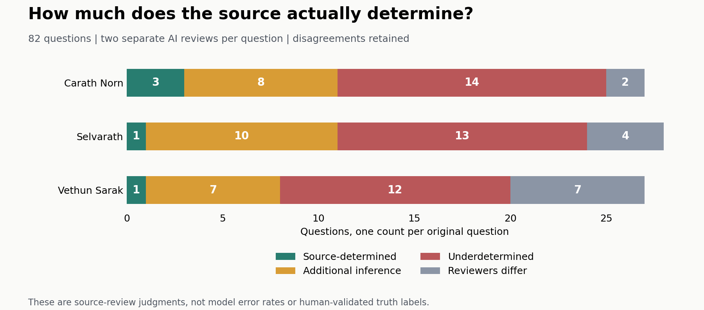

# Question and evidence audit

Completed 2026-09-12. This audit covers all **82 questions** used in Phases 3, 4 and 5. Two AI reviewers independently assessed every question from its full source document and both candidate answers, producing **164 source reviews**. No experiment provider calls were made.

**Main finding:** both reviewers classified 5/82 core answers as source-determined, 25/82 as requiring additional interpretative assumptions, and 39/82 as underdetermined. They differed on 13/82 classifications. This is an audit of source sufficiency, not an estimate of how many original answer keys are wrong.

| Source world | Decisive core | Inferential | Underdetermined | Reviewers differ |
|---|---:|---:|---:|---:|
| Carath Norn | 3 | 8 | 14 | 2 |
| Selvarath | 1 | 10 | 13 | 4 |
| Vethun Sarak | 1 | 7 | 12 | 7 |
| **Total** | **5** | **25** | **39** | **13** |

The reviewers agreed on the determinacy category for **69/82** questions and preferred the original keyed candidate in both reviews for **54/82**. Preference and determinacy are different: a candidate can be better supported than a weak alternative without its central comparison being settled by the source. The stricter criterion here is intended to select diagnostic questions with clear truth conditions. It is not a requirement that every legitimate reasoning task be reducible to literal quotation.

**Potential diagnostic panel:** 5 questions have a source-determined core and both reviewers prefer the original key: CN-007, CN-018, CN-033, SEL-004, VS-002. Candidate explanations were reviewed separately. Their flags include interpretative or speculative extensions, including explicitly tentative claims; these require case-by-case assessment and are not all false statements. For example, a correctly qualified possible treaty interpretation need not itself be a defect. The shortlist is provisional and requires a final check of shortened answer options and paired evidence before use. This audit does not release a certified full-text candidate set or establish that any existing query history already contains sufficient evidence.

Three examples show why the distinction matters:

- **CN-010, consequences of replacing fixed-price grain trade with market pricing:** the source states that pricing changed, but gives neither the old price nor the later market price. A lower market price and a higher market price are both compatible with the document and support different economic stories. See [source paragraph 11](../../world_specs/carath_norn.txt#L11).
- **VS-029, favorable versus exploitative grain loans:** amount, rate and repayment are recorded. Alternative credit terms, bargaining alternatives, risk and the criterion for exploitation are not. Perfect verification of the recorded loan facts would still leave the evaluative comparison open. See [source paragraph 11](../../world_specs/vethun_sarak.txt#L11).
- **CN-018, whether the Moot can prevent consolidation:** the source explicitly states that it currently has no such mechanism. This is the kind of compact decisive fact a controlled evidence experiment could use. See [source paragraph 15](../../world_specs/carath_norn.txt#L15).

There are also specific defects beyond interpretative uncertainty. In **VS-003**, the keyed explanation calls a change from 5-of-7 to 5-of-6 a preservation of the proportional threshold; those fractions are different. It also assigns earlier succession success to the seven-member system even though the current Archon began ruling about Year 79, after the unreversed Year 53 merger. This does not establish that the fallback council procedure was used at that accession, but it rules out assuming every prior accession occurred in the seven-member configuration. Separately, the Vethun Sarak source calls the present year 112 and describes the Year 112 Massing as scheduled for next year. These are local candidate/source defects, not demonstrated causes of the model difference. See [the succession rules](../../world_specs/vethun_sarak.txt#L6), [merger history](../../world_specs/vethun_sarak.txt#L11), and [present situation](../../world_specs/vethun_sarak.txt#L15).

**What this changes:** the earlier numerical results still describe choices against the frozen author key. The audit limits their interpretation as measurements of uniquely correct source-grounded answers across the whole panel. It does not show that ambiguity caused the recipient gap, establish that the alternative keys are correct, or reverse any previous experimental result. No old scores or datasets were changed, and no question was selected because a particular model succeeded or failed.

The information limit is straightforward: if two situations satisfy every supplied source fact but require different answers, an oracle restricted to those source facts cannot distinguish them. Additional correct verification cannot supply the missing premise. The judge must retain uncertainty or introduce assumptions. This conditional argument explains why source sufficiency matters; it does not identify either model's internal reasoning or prove that this mechanism produced the measured gap.

**Recommended next step:** use the 5-question shortlist for a small sanity check after reviewing and shortening its candidate answers. It is too narrow to support a broad transfer conclusion. Before another substantial experiment, author new worlds with explicit rules, independently checked answer keys, and balanced candidate length and specificity. Then compare decisive versus incidental evidence on those questions. Retaining multiple transcripts or mirrored sides does not create additional independent question clusters. Reusing this panel is exploratory; a later transfer claim needs new questions and additional model families. An automatically useful evidence selector remains a separate research question. Whether the decisive facts are reachable under the existing query restrictions also requires a separate check; manually supplying decisive excerpts would be a capability diagnostic, not a deployment test of the original querying protocol.

**Method and limits:** packet construction used the exact 82 main IDs, excluded the same 24 calibration questions, and permuted candidate order with a fixed hash seed. Packets omitted gold labels, author rationales, facts-required lists, model identity, traces and outcomes. The two reviewers used separate fresh contexts and did not see each other's judgments. Both are AI reviewers from the same model family, so their errors may be correlated; this is not independent human validation. Candidate wording can reveal the author's intended preference despite label masking: the keyed candidate is longer in 82/82 cases. Root retained prior aggregate context and saw some key rows during preparation, then checked provenance, exact quotations and concrete source/candidate defects. Disagreements remain visible instead of being forced into consensus. No verdict files were loaded to classify or select questions.

Every review row has exact source quotations, assumptions and a source-compatible alternative when the core is not decisive. The original question-bank canonical hashes match the experiment protocol, source texts match the archived Phase 4B texts, all 82 IDs match the Phase 4/5 panel, and cited quotes are checked verbatim against their recorded line spans. Raw packets, both full reviews and the original key map are kept outside Git at `E:\selvarath-archive\question-evidence-audit-2026-09-12`. Public artifacts: [question-by-question matrix](audit-matrix.md), [candidate evidence excerpts](evidence-candidates.md), [full audit summary](summary.json), and [verification](verification.json).

